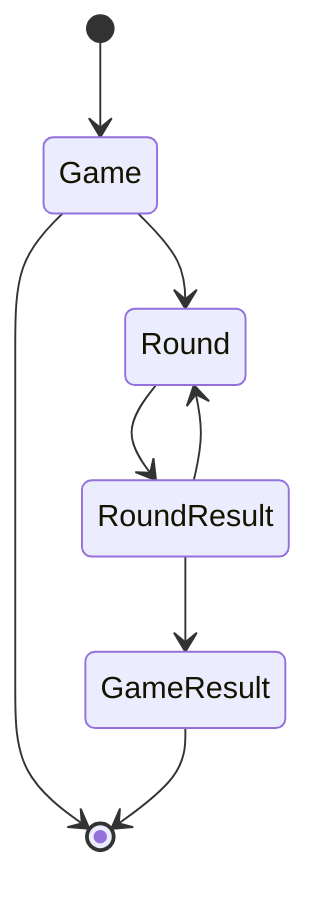
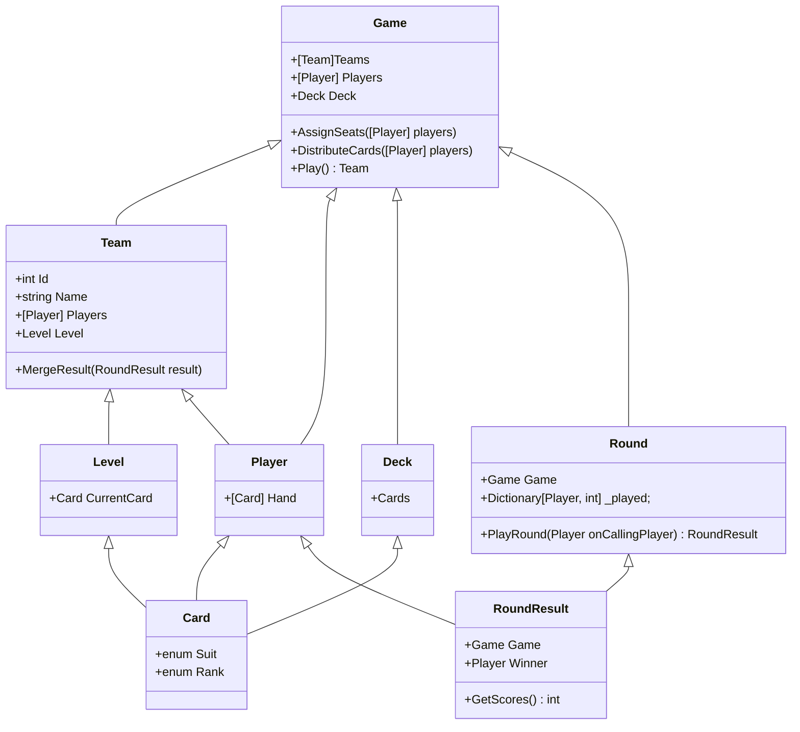

# GuanDan 


[GuanDan](https://zh.wikipedia.org/zh-hans/%E6%8E%BC%E8%9B%8B) is one of most popular poke games spreading fast in South of China.

This project is a simple implement of GuanDan, not all the rules are applied.


## Run locally

open the `./GDGame/GDGame.sln` with Visual Studio and press `F5`, you will run a mock game.


### Change strategy to play cards

you can create a new class extends from `GDPlayer`, here is a built in sample

```cs
public class EasyStrategy : GDPlayer
{
    public EasyStrategy(string name) : base(name)
    {

    }

    public override (bool, List<GDCard>?, int) Play(GDRound round, List<GDCard>? playedCards)
    {
        Random random = new Random();
        bool chooseToPlay = random.Next(2) == 0;
        if (playedCards == null || chooseToPlay)
        {
            var start = SingleRankHigher(playedCards);
            return (start != null, start, Hand.Count);
        }

        return (false, null, Hand.Count);
    }
}
```


## Design Concept

here is a State Transition workflow



## How these objects work together?

